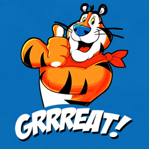

This Is A Section Header
------------------------

This document is a test of basic familiarity with Restructured Text (RST) and sphinx-doc. Using this document as a visual model, setup a source tree to reproduce it (structurally) and produce a static HTML tree using the readthedocs theme. Ignore color in section and sub-section titles as this is handled by the theme.

The HTML document will not look exactly like this, but it should be the same structurally speaking. For someone with basic Python skills, this task should take less than 60 minutes, even if you’ve never looked at sphinx-doc or Restructured Text before.

.. hint::
   There is no TOC in this document, but there should be a proper sidebar in the HTML output with links to the top 2 section header levels.

This is a Subsection Header
~~~~~~~~~~~~~~~~~~~~~~~~~~~

The table below is simple to do with RST...

.. csv-table:: A Fun Little CSV Table
   :header: "Item", "Description"
   :widths: 10, 25

   "Foo", "To Foo or not to Foo, that is the question 2"
   "Bar", "A great place to hang after work"
   "Baz", "This description references a footnote [#]_"

This Subsection has a Figure
~~~~~~~~~~~~~~~~~~~~~~~~~~~~~

There is an image below...

   YAY Frosted Flakes!!!

Fun Fact!
^^^^^^^^^

   The original oranges from Southeast Asia were a `tangerine-pomelo hybrid <https://www.telegraph.co.uk/men/the-filter/qi/8345477/QI-Quite-interesting-facts-about-orange.html>`_, and they were actually green. In fact, oranges in warmer regions like Vietnam and Thailand still stay green through maturity. For more interesting facts, find out `which "orange" came first: the color or the fruit <https://www.rd.com/food/fun/orange-word-color-fruit/>`_.

This is Another Section
-----------------------

There is a code block right below this line...

.. code-block:: python
   :linenos:

   import sys

   def main():
       print('Hello, World from Python 3!)

   if __name__ == '__main__':
       main()

.. note:: This is an image because Word on the web does not have a way to do this right. You must do a real code block with RST.

Final Section
-------------

Bonus points for:

#. Putting a caption on the table
#. Putting a caption on the image
#. Adding a "Note" block in any section
#. Adding a sample Glossary at the end with 3 or so entries
#. Putting the image and/or the code block on the right side of the doc with some text flowing around it on the left (hint: look at the readthedocs theme web site demo documents)

.. [#] This is the text of footnote 1

Glossary
--------

.. glossary::

   argon (Ar)
      Element #18 on the periodic table, Argon is a noble gas. It is colorless, odorless and extremely unreactive. Argon forms no stable compounds at room temperature.

   buoyancy
       The ability to float, or in more technical terms – the upward forces exerted by a fluid on a body in it.

   ecosystem
       a isolated group of living (plants, animals, people) and non-living (rocks) things that coexist together and interact which each other to ensure each others’ survival.